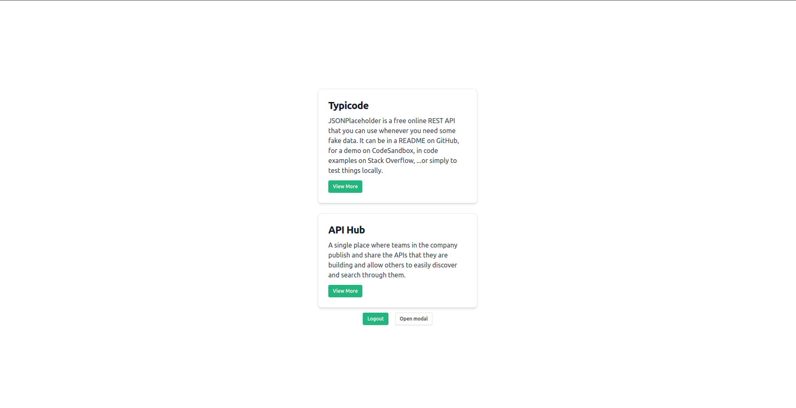
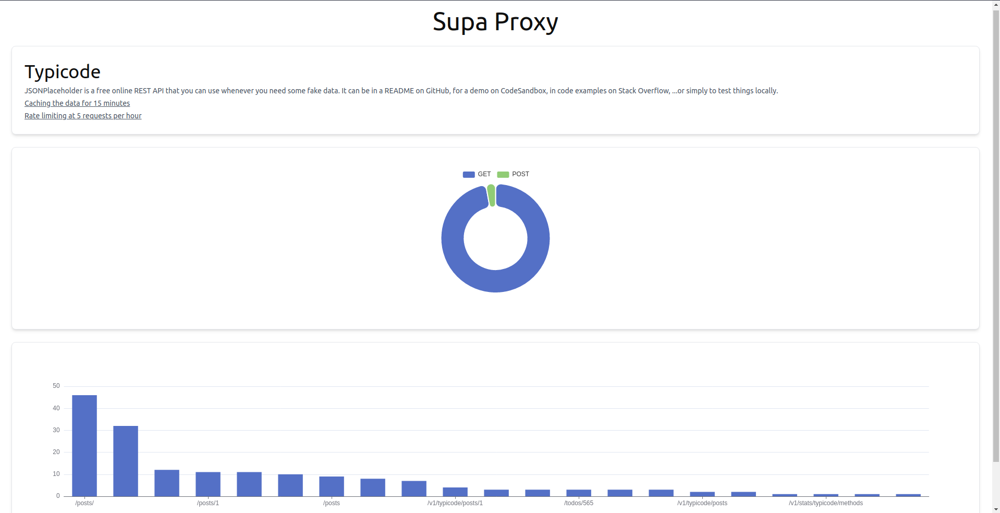

## SUPA-PROXY

#### Problem's We Have

Need to make your API's public? No problem! We covered you.
Checkout **SupaProxy**. An API proxy that allows you to make your API's public.

#### SupaProxy provides three solutions for your API

    1.Rate Limit Layer
    2.Cache Layer
    3.Proxy Layer

#### How we solve Problems.

    SupaProxy Provides three layer of security to your API. 
    First we set the rate limit for your API.This helps to limit the access to your API.
    Second we have Cache Layer. This layer helps to cache the data of your API and Prevent overload of your server.
    Third we have Proxy Layer. This layer helps to proxy the data of your API and Prevent the direct access to the API.

#### Additional Functionalities.
    
    Stats Page for Monitoring the performance of your API.
    Graph to visualize the most requested endpoints and most used methods

#### Tech Stack Used.

    1. NodeJs + Typescript + Express
    2. ReactJS + Typescript + TailwindCSS

#### Technologies Used.

    1. Supabase Auth
    2. Supabase Database
    3. Supabase UI
    4. Redis Cache
    5. Axios

#### Limitations.

    Currently we aren't supporting new API's. We're working on it and some other features.

### SceenShots.

### The Team.
@pintoinfant - [Twitter](https://twitter.com/pinto_infant), [Github](https://github.com/pintoinfant)
@gabrielantony - [Twitter](https://twitter.com/gabrielaxyeth), [Github](https://github.com/gabrielantonyxaviour)